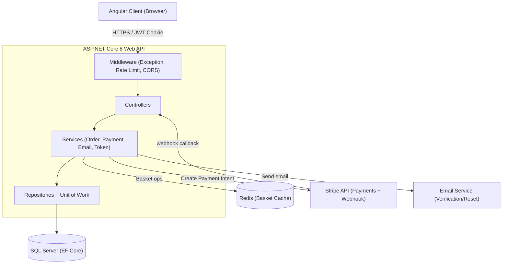

# System Architecture

This diagram shows my system at a container level: the Angular client,
the API and its internal layers, and the external systems it depends
on. I confirmed each component directly in my own code: SQL Server
through EF Core, Redis through the StackExchange.Redis package
registered in infrastructureRegisteration.cs, and the Stripe integration
in PaymentService.cs and PaymentsController.cs.