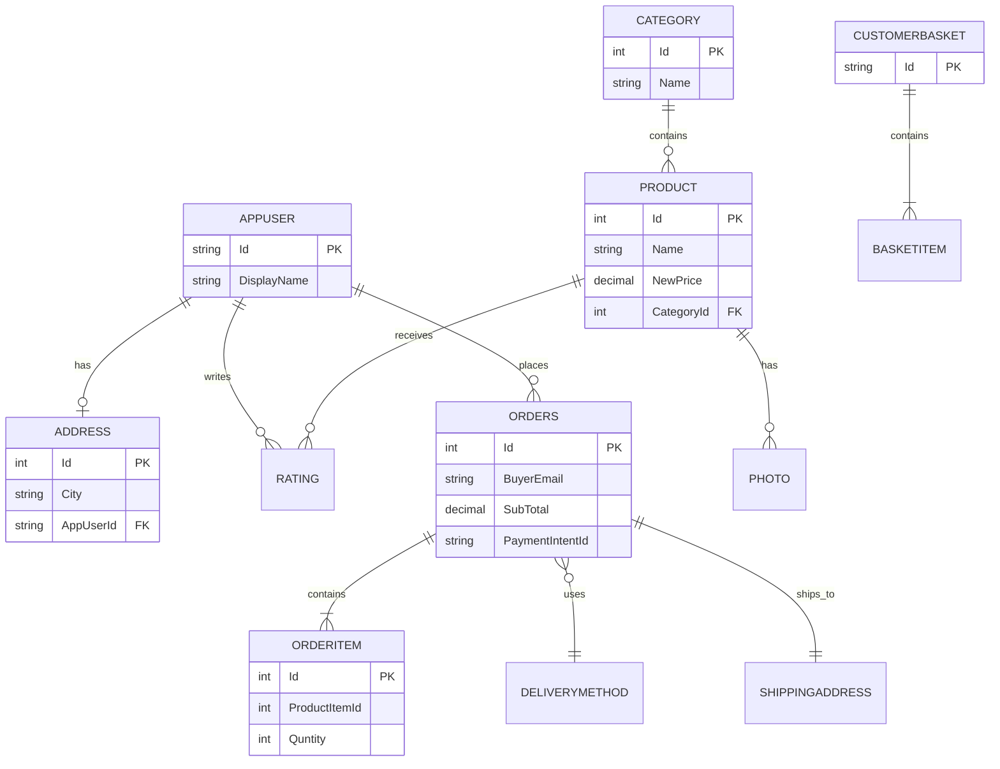

# Entity Relationship Diagram

This renders automatically on GitHub. It is based on the entities I
have implemented so far in Ecom.Core/Entities.

## Design Note on OrderItem

Looking at my OrderItem class, it is not connected to the Product table
through a foreign key. Instead, it stores its own copy of the product
name, price, and image at the time the order is created. This is a
pattern I recognize from general e-commerce design, sometimes called a
snapshot pattern, and the usual reason for it is that if a product's
price changes later, past orders still reflect what the customer
actually paid. I am noting this as my own interpretation of the code
structure, not something the course explained directly, so I will
confirm it once I reach the related video.

## Known Gap

CustomerBasket.Id has no relationship to AppUser. A basket is only
identifiable by its own GUID. See Security Finding 3 in requirements.md.